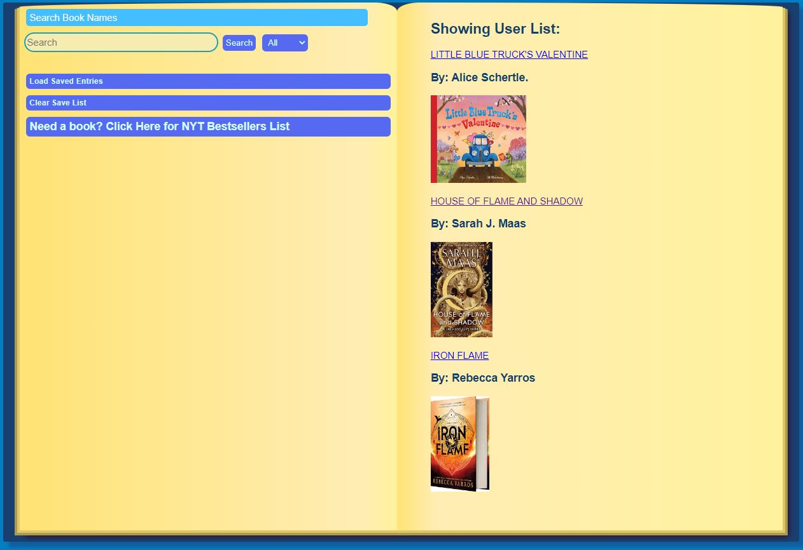
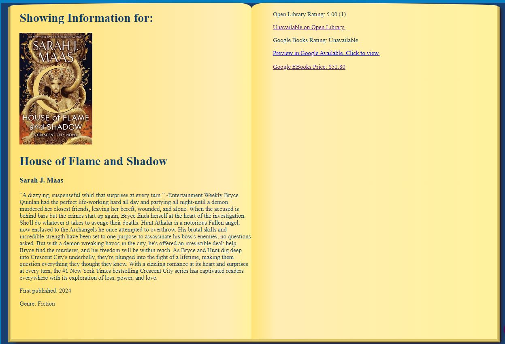

# 07 Project 1: Interactive Front-End Application:  Group 4 - Book Service App

Group 4: Aaron Porter-Brooks, Michael Anthony Rodriguez, Ryan Moises 

## Objective

To build an app that a student or a book reader can used to search for information about a book, including eBook access

## User Story

```
AS A student,
I want to look up sources available versions of Ebooks and their reviews and ratings
SO THAT I have accessbility to the sources I need for my education
```

## Acceptance Criteria

```
GIVEN I am searching for a book
WHEN I open the app
THEN I am presented with a search bar, a list to save books I am interested in, and a recommendations from the New York Times Bestseller Lists
WHEN I search for a book using its title, author, or ISBN
THEN I can view information about the book and links to its eBook
WHEN I search for a book
THEN I can save the book to a personal user list
WHEN I click on items in the personal user list
THEN I can find details about the book and links to its eBook
WHEN I view the New York Times Best Sellers list
THEN I can use the displayed items to search for information about the book and its eBook
WHEN I view the details about the book
THEN I can see the ratings of the book from different sources and (if available) a link to the New York Times review
```

## Technologies Used
JQuery library
Open Library API
New York Times Books API
Google Books API
Foundation Framework for CSS

## URLs and Images 

The following link is the group's URL to the completed assignment:
(https://ryanmoises5.github.io/BookService-Group4-Project1/)

The following link is the Github repository where the associated files are located:
(https://github.com/RyanMoises5/BookService-Group4-Project1)

Front Page of the Book Service App:



Display Page of the Book Service App:



---

Group 4: Aaron Porter-Brooks, Michael Anthony Rodriguez, Ryan Moises 